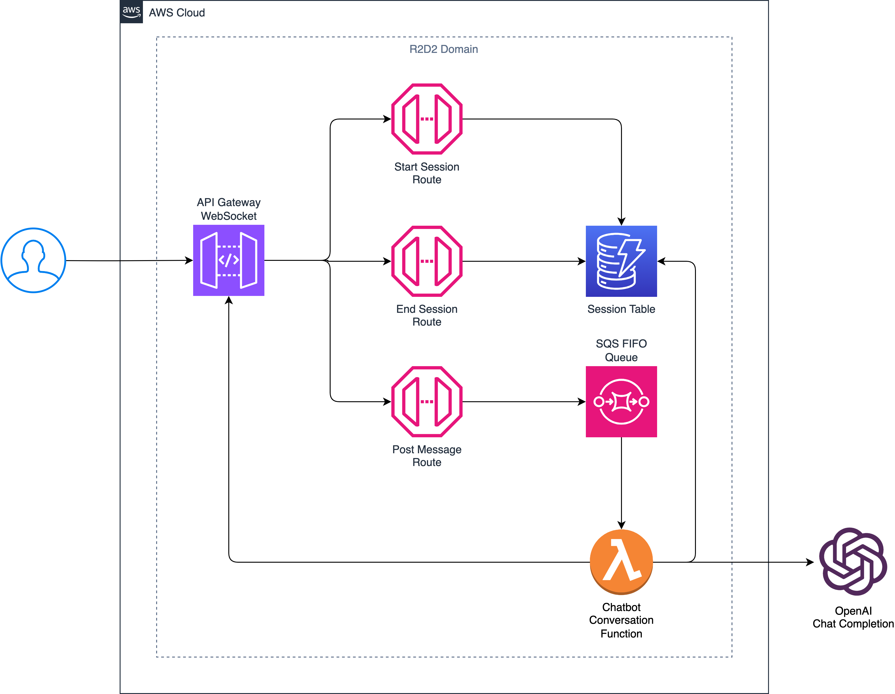

# R2D2 Chatbot

### Description

The R2D2 Chatbot is a simple chatbot that uses OpenAI Chat Completion API to generate responses to user input. 
The chatbot is implemented in Python and uses the `openai` library to interact with the OpenAI API.

### Architecture
Chatbot is based on AWS Cloud infrastructure.

Architecture of the chatbot infrastructure is shown in the diagram below:



### Assumptions

- You have an AWS account and have the necessary permissions to create the resources.
- You have an OpenAI account and have the API key. 
- You have Python installed on your local machine.
- You have Node.js installed on your local machine.
- You have the AWS CLI installed on your local machine.
- You have the AWS CDK installed on your local machine.
- You have Python installed on your local machine.
- You have the Docker installed on your local machine.

### Installation and Deployment

To install project dependencies, run the following command:

```bash
pip install .
```

Project requires the following environment variables to be set:
- DOMAIN_PREFIX - domain prefix for the chatbot. The prefix is used for naming the AWS resources.
- OPENAI_API_KEY - OpenAI API key. You can get the API key from the OpenAI dashboard.
- AWS_DEFAULT_REGION - AWS region where the resources will be created.
- AWS_ACCESS_KEY_ID - AWS access key ID.
- AWS_SECRET_ACCESS_KEY - AWS secret access key.

To export the environment variables, run the following command:

```bash
export DOMAIN_PREFIX=<domain_prefix>
export OPENAI_API_KEY=<openai_api_key>
export AWS_DEFAULT_REGION=<aws_region>
export AWS_ACCESS_KEY_ID=<aws_access_key_id>
export AWS_SECRET_ACCESS_KEY=<aws_secret
```

To deploy the chatbot infrastructure, run the following command:

First you need to bootstrap the CDK:

```bash
cdk bootstrap
```

Then you can deploy the chatbot infrastructure:

```bash
cdk deploy --all
```

To remove the chatbot infrastructure, run the following commands:

```bash
cdk destroy --all --force
```

### Usage

There is no web interface for the chatbot. You can interact with the chatbot using Postman.

After deployment of the chatbot infrastructure get WebSocket URL from AWS API Gateway console.

Interaction steps:

#### 1. Open WebSocket connection using the WebSocket URL.
#### 2. To start a chatbot session, send a WebSocket message to `chatbot_session_start` route.

Request message:
```json
{
  "action": "chatbot_session_start",
  "gpt_model": "gpt-3.5-turbo"
}

```
- `action` - indicates WebSocket route.
- `gpt_model` - indicates GPT model to use for chatbot. Optional parameter. Default value is `gpt-3.5-turbo`.

Response message:
```json
{
    "type": "session_start",
    "data": {
        "session_id": "41eb27a0-d382-40c4-ad38-fbd1cb629b7f"
    }
}
```
- `type` - indicates WebSocket message type.
- `data` - contains the session ID.

#### 3. To start a chatbot conversation, send a WebSocket message to `chatbot_post_message` route.

Request message:
```json
{
  "action": "chatbot_post_message",
  "session_id": "41eb27a0-d382-40c4-ad38-fbd1cb629b7f",
  "system_message": "You are coll robot!",
  "user_message": "Please write me cool poem."
}
```
- `action` - indicates WebSocket route.
- `session_id` - indicates chatbot session ID.
- `system_message` - indicates system message. Optional parameter.
- `message` - indicates user message.

Response messages:

After sending the user message, you will receive  multiple WebSocket messages.
The first message will indicate that the chatbot is processing the user message.
```json
{
    "type": "processing_start",
    "data": null
}
```
The second message will contain the chatbot response.
```json
{
    "type": "message",
    "data": "In the quiet of the night, words dance in my mind. A symphony of thoughts waiting to be refined..."
}
```
- `type` - indicates WebSocket message type.
- `data` - contains chatbot response.

The third message will indicate that the chatbot has finished processing the user message.
```json
{
    "type": "processing_end",
    "data": null
}
```

#### 4. To end a chatbot session, send a WebSocket message to `chatbot_session_end` route.
This step is optional as the chatbot session will be automatically ended on the closure of the WebSocket connection.

Request message:
```json
{
  "action": "chatbot_session_end",
  "session_id": "41eb27a0-d382-40c4-ad38-fbd1cb629b7f"
}
```
- `action` - indicates WebSocket route.
- `session_id` - indicates chatbot session ID.

Response message:
```json
{
    "type": "session_end",
    "data": null
}
```

### Testing
There are integration tests for the chatbot infrastructure.

There are additionally dependencies that need to be installed to run the tests.
To install dependencies for the tests, run the following command:

```bash
pip install -r r2d2_test/requirements.txt
```

To run the tests, run the following command:

```bash
pytest r2d2_test/integration/tests
```

Pytest will deploy testing infrastructure, run the tests, and destroy the testing infrastructure.
